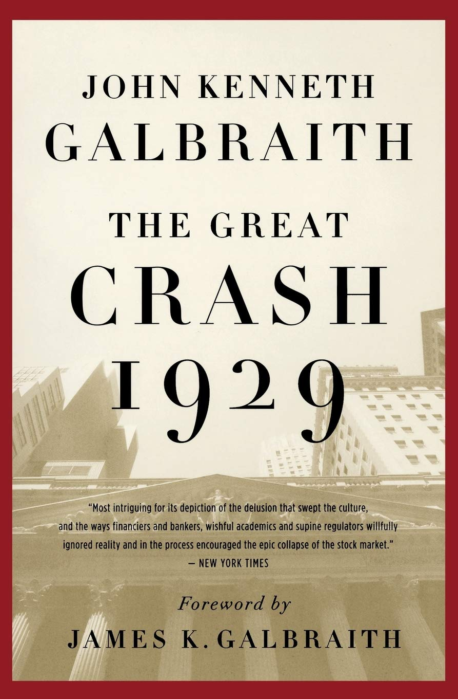

[]

## An excellent historical account
Galbraith's flowing, clear history focuses on the events that transpired in 1929, including the climax of the devastating financial markets crash, which took place in late October. The material herein is presented from a historical perspective, rather than an economics perspective--discussions of the economics behind the crash are offered in qualitative settings; this is not substantive economics, complete with precise statements derived from a solid analytical foundation.

While it is not a work in the field of economics, Galbraith's work is a fantastic history book--his research was done meticulously (notice the quality of his sources, as apparent in the footnotes), and he successfully blends a wide swath of sources into prose that makes the history accessible.

If one desires to build an accurate understanding of the tragic 1929 financial collapse that marked the beginning of the Great Depression, Galbraith's book is a good starting point. Often, learning the financial history of a specific period helps facilitate later intellectual excursions aimed at a deeper understanding of the economics that drove such history. As such, Galbraith's The Great Crash, 1929 would serve as an excellent prelude to the works of Bernanke and other economists.
